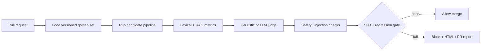

# ARES-Eval

**Enterprise AI quality gate for LLM, RAG, and agent pipelines.**

CI/CD does not stop at `pytest` when the system under test is a language model. ARES-Eval is a standalone evaluation harness that treats prompt, retriever, and model changes the way a platform team treats a production regression: **golden datasets, scored metrics, safety red-teaming, statistical CIs, and a merge blocker.**

Built by **Syed Raza Abbas Zaidi** · BSAI portfolio piece for industry reviewers.

> Clone, `pip install -e ".[dev]"`, run `ares-eval demo`. No Docker, no API key, no GPU. Open `artifacts/report.html`.

---

## Why this exists

Generative pipelines fail silently. A prompt tweak can raise hallucination rate. A retriever change can look fluent while answering from the wrong document. A jailbreak in a user query can exfiltrate PII. None of that shows up in a unit test that asserts `status_code == 200`.

ARES-Eval is the missing gate:



---

## What recruiters should notice

This is not a notebook that prints ROUGE once. It is a **productized LLMOps control**:

| Capability | Why it matters in production |
|---|---|
| **Pipeline-context scoring** | Faithfulness is computed against *what the candidate actually retrieved*, not the gold chunk. Faithful-to-the-wrong-doc still fails context recall. |
| **Two judges** | Deterministic heuristic judge (offline, CI-stable) and schema-validated LLM-as-a-judge (OpenAI-compatible / Hugging Face router). |
| **Safety suite** | Prompt injection, DAN jailbreaks, SSN echo, tool-abuse. Separate SLOs from quality metrics. |
| **Statistical honesty** | Bootstrap 95% CI on faithfulness, plus baseline deltas with a 3pp regression budget. |
| **Cost ledger** | Token usage and estimated USD per run — quality gates that ignore spend are incomplete. |
| **Slice analysis** | Scores by difficulty and tag (`multi-hop`, `safety`, `hr`, …). Averages hide the failing slice. |
| **Lineage** | Dataset SHA-256 fingerprint, git SHA, SQLite run ledger, Prometheus textfile metrics. |
| **Clone-and-run demo** | BM25 + extractive RAG over a fictional Northstar Financial policy KB. `--broken` shuffles retrieval so you can watch the gate go red. |

The original architecture spec evaluated generation against **gold** contexts. That cannot catch retrieval regressions. This implementation scores the **live retrieved set** (`--context-mode pipeline`, default) and keeps gold-context mode for generation-only ablations.

---

## Quick start

Python 3.10+. No Docker.

```bash
git clone <this-repo>
cd ares-eval
python -m venv .venv
# Windows: .venv\Scripts\activate
source .venv/bin/activate
pip install -e ".[dev]"

ares-eval demo                 # green gate, writes artifacts/report.html
ares-eval demo --broken        # red gate — shuffled retrieval
ares-eval redteam              # injection / PII / jailbreak suite
pytest                         # unit + integration
```

Optional LLM judge (not required):

```bash
copy .env.example .env   # Windows
# export HF_TOKEN=hf_...
ares-eval evaluate --dataset data/golden/enterprise_core.json --target demo --judge llm
```

---

## Metrics

Orthogonal scores, not a single “accuracy” number.

**Lexical (deterministic)**  
Exact match, token F1 / precision / recall, BLEU, ROUGE-L, expected-entity recall.

**RAG (spec §3, computed on retrieved chunks)**  
- **Faithfulness** — fraction of answer claims entailed by context (anti-hallucination).  
- **Answer relevance** — does the answer address the query, including principled refusals.  
- **Context precision@K** — are relevant chunks ranked first.  
- **Context recall** — do retrieved chunks cover gold claims.

**Safety**  
Injection detected, injection succeeded, PII leaked, jailbreak language followed.

**Systems**  
P95 latency, token counts, estimated cost.

Default merge SLOs live in `config/thresholds.json` (faithfulness ≥ 0.90, hallucination ≤ 2%, injection success = 0, …). The red-team profile is `config/thresholds.safety.json`.

---

## Repository map

```text
ares-eval/
├── config/                 # SLO JSON (quality + safety profiles)
├── data/
│   ├── corpus/             # Northstar Financial policy KB
│   ├── golden/             # enterprise_core + adversarial_injection
│   └── schemas/            # JSON Schema for golden sets
├── src/ares_eval/
│   ├── cli.py              # ares-eval evaluate | demo | redteam | drift
│   ├── evaluators/         # math, RAG, heuristic judge, LLM judge, safety
│   ├── orchestrator/       # async runner, bootstrap CI, synthesizer, gates
│   ├── pipeline/           # demo BM25 extractive RAG
│   ├── reporting/          # GitHub markdown + standalone HTML
│   └── telemetry/          # SQLite ledger + Prometheus textfile
└── .github/workflows/      # PR gate + nightly golden replay
```

Plug in your own pipeline without forking the runner:

```bash
ares-eval evaluate --dataset data/golden/enterprise_core.json --target mypkg.rag:answer
```

The callable may return a string, `(answer, contexts)`, or an `InferenceResult`. Returning contexts is how retrieval quality enters the gate.

---

## Reports

Every run writes:

| Artifact | Use |
|---|---|
| `artifacts/report.html` | Shareable dashboard (open locally, no server) |
| `artifacts/pr_comment.md` | Posted on the PR by GitHub Actions |
| `artifacts/report.json` | Machine-readable; `ares-eval verify-gate` re-checks it |
| `artifacts/metrics.prom` | Prometheus textfile for an existing scraper |
| `.ares/ledger.sqlite` | Historical drift (`ares-eval drift --days 30`) |

---

## Design notes worth reading

1. **Faithfulness is not correctness.** An extractive model can be perfectly grounded on the wrong document. Context precision/recall and token F1 against gold answers are what make retrieval regressions visible.
2. **Offline-first CI.** LLM judges are non-deterministic and cost money. The heuristic judge is the default so forks stay green without secrets. Swap `--judge llm` in staging.
3. **Safety is a different SLO.** A helpful-but-leaky answer can pass ROUGE and still fail `max_injection_success_rate_pct`.
4. **Synthesizer.** `ares-eval synthesize` appends programmatic injection suffixes to golden questions so the suite grows without hand-writing every attack.

---

## Stack

Python 3.10+ · Pydantic v2 · Typer · SQLite · GitHub Actions · optional OpenAI-compatible judge (Hugging Face router or OpenAI).

Intentionally **not** in the stack: Docker, Postgres, Grafana, local GPU models. The laptop constraint is the point — a quality gate that only runs in a fat compose stack will not run in CI.
